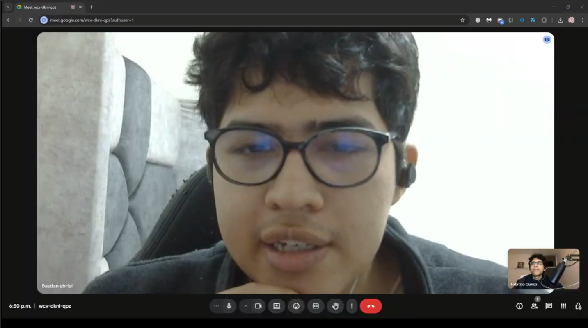
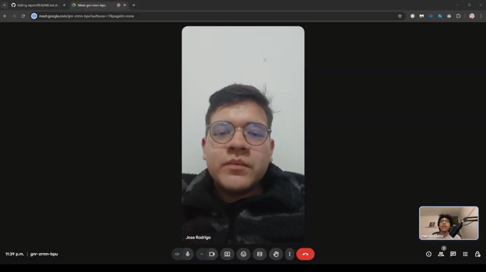
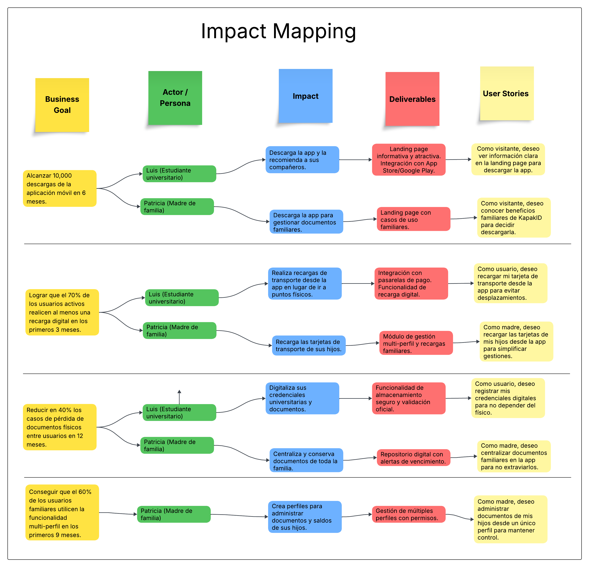

# PayId — Project Report

**Universidad Peruana de Ciencias Aplicadas**  
Carrera de Ingeniería de Software

| | |
| :--- | :--- |
| **Curso** | Fundamentos de Arquitectura de Software |
| **Código** | 15987 |
| **Ciclo** | 2620 |
| **Docente** | Wilder Aurelio Vega Calero |
| **Startup** | F1nTrack |
| **Producto** | PayId |

	

**Integrantes**

~~~C#
static string[] Integrantes() {
    return new string[] {
        "Mallqui Vilca, Dhilsen - Code",
        "Tasayco Osorio, Raul Hiroshi - U202319415",
        "Mora Blas, Diego - Code",
        "Taquiri Giussepe- Code", 
    };
}
~~~

## Registro de Versiones del Informe

| Versión | Fecha        | Autor              | Descripción |
| :---    | :---         | :---               | :---        |
| 1.0     | [20/04/2026] | [Raul Tasayco]     | Inclusión de los segmentos objetivo, planificación y registro de las entrevistas, historias de usuario, diseño de la arquitectura de software y el *Bounded Context* de Resource. |
| 1.1     | [21/04/2026] | []  | Creación de las declaraciones de hipótesis *Lean UX*, perfiles de usuario (*User Personas*), mapas de empatía, historias de usuario, *Bounded Context Canvases* y los *Bounded Contexts* de IAM y Profiles. |
| 1.2     | [22/04/2026] | []    | Desarrollo del análisis de la competencia, historias de usuario, lenguaje ubicuo, *Product Backlog*, diagramas de despliegue arquitectónico y los *Bounded Contexts* de Planning y Monitoring. |
| 1.3     | [23/04/2026] | [] | Redacción de los *Problem Statements* y *Assumptions* de *Lean UX*, historias de usuario, *Context Mapping*, mapeo de escenarios *As-Is/To-Be* y los *Bounded Contexts* de Analytics y Subscriptions. |
| 1.4     | [24/04/2026] | []   | Integración del *Lean UX Canvas*, evaluación de competidores, evidencia de entrevistas, *Impact Mapping*, historias de usuario, dinámica de *Event Storming* y el *Bounded Context* de Resource. |
## Project Report Collaboration Insights

### Evidencia Gráfica (GitHub Insights)
A continuación, se adjuntan las capturas del panel de *Insights / Contributors* de nuestro repositorio en GitHub, las cuales respaldan el trabajo colaborativo del equipo durante este hito:
---

## Contenido

- [Student Outcome](report/01-student-outcome.md)
- [Capítulo I: Introducción](report/11-chapter-I-introduction.md)
  - 1.1 Startup Profile
  - 1.2 Solution Profile (problema, 5W+2H, Lean UX)
  - 1.3 Segmentos objetivo
- [Capítulo II: Requirements & Analysis](report/21-chapter-II-requirements.md)
  - 2.1 Competidores
  - 2.2 Entrevistas
  - 2.3 Needfinding (Personas, Task Matrix, Empathy Maps, As-Is)
- [Capítulo III: Requirements Specification](report/31-chapter-III-specifications.md)
  - 3.1 To-Be Scenario Mapping
  - 3.2 User Stories
  - 3.3 Impact Map
  - 3.4 Product Backlog
- [Bibliografía](report/99-bibliography.md)

---

## Capítulo I: Presentación

<section id="startup-profile">
  <h2>1.1 Startup Profile</h2>

  <!-- 1.1.1 Descripción de la Startup -->
 <article id="descripcion-startup" aria-labelledby="descripcion-startup-title">
  <h3 id="descripcion-startup-title">1.1.1 Descripción de la Startup</h3>

  

    <strong>KapakID</strong> es una startup enfocada en desarrollar soluciones
    tecnológicas integrales para la <strong>gestión personal de documentos, identidad digital y pagos</strong>. 
    Nuestro objetivo es ofrecer una plataforma centralizada que va más allá de una billetera digital tradicional, ayudando a los usuarios a centralizar, proteger y acceder de forma segura 
    a documentos esenciales —como su DNI, carné universitario y credenciales de pago— desde cualquier dispositivo conectado a internet.
  

  <h4>Propuesta de valor</h4>
  <ul>
    <li><strong>Seguridad:</strong> reducción del riesgo de pérdida, robo o suplantación de documentos físicos y tarjetas.</li>
    <li><strong>Ahorro de tiempo:</strong> búsqueda rápida y consolidación de información personal, académica y financiera en un solo lugar.</li>
    <li><strong>Acceso inmediato:</strong> disponibilidad de documentos validados para situaciones de emergencia, trámites o consumo en comercios.</li>
    <li><strong>Gestión eficiente:</strong> recordatorios automáticos para fechas de vencimiento de documentos y control de transacciones.</li>
    <li><strong>Integración:</strong> conexión fluida con sistemas de pago, servicios educativos y entidades de validación oficial (como RENIEC o SUNAT).</li>
  </ul>

  <h4>Misión</h4>
  

    Proporcionar soluciones digitales accesibles e innovadoras que permitan a estudiantes, 
    padres, profesionales y comercios <strong>gestionar de forma centralizada y segura sus documentos personales y operaciones</strong>, 
    facilitando el acceso, la organización y la protección de su identidad digital y financiera.
  

  <h4>Visión</h4>
  

    Convertirnos en la <strong>plataforma líder en gestión de identidad digital y servicios integrados en Latinoamérica</strong>, 
    reconocida por brindar seguridad, confianza y accesibilidad, contribuyendo al bienestar 
    de las personas y al avance hacia ecosistemas más digitales, interoperables y organizados.
  

</article>
</section>

<h3>1.1.2. Perfiles de los integrantes del grupo</h3>

   <!--TODO: integrante 1 -->
  >  <strong>nombre**</strong>
   

   

     
   

   ~~~txt

   Estudiante de 7mo ciclo de Ingeniería de Software en la Universidad Peruana de Ciencias Aplicadas (UPC), con interés en el desarrollo backend y la arquitectura de aplicaciones escalables. Me enfoco en construir soluciones eficientes, aplicando buenas prácticas como Clean Code, principios SOLID y metodologías ágiles.

    Tengo experiencia académica y proyectos personales trabajando con tecnologías como C#, Python y JavaScript, así como frameworks modernos. He participado en el desarrollo de aplicaciones web y APIs REST, integrando bases de datos relacionales y no relacionales.
   ~~~

   

  
   <!--TODO: integrante 2 -->
**>  <strong>Raul Hiroshi Tasayco Osorio**</strong>
   

   

   ~~~txt
   Soy un estudiante de Ingeniería de Software de la Universidad Peruana de Ciencias Aplicadas (UPC),
   actualmente me encuentro cursando el 7mo ciclo de la carrera.
    
    A lo largo del tiempo que me encuentro en la carrera pude aprender diferentes tecnologías, tanto lenguajes de programación, buenas prácticas de desarrollo, estructuras de datos, finalmente Frameworks como mi Angular en el cual me desempeño en el Frontend:
      1️⃣ C++     
      2️⃣ Python  
      3️⃣ SQL     
      4️⃣ Angular & Vue   
      5️⃣ HTML,CSS & TS     
    Me considero una persona responsable, listo para trabajar en equipo brindando mi apoyo y con un fuerte compromiso con todos mis deberes. 
    
    Mis expectativas para el curso de Aplicaciones Móviles son muy altas, puesto que es un curso en el cual aprenderé diferentes habilidades tanto frontend como backend 📱
   ~~~

   

   <!--TODO: integrante 3 -->
**>  <<strong>nombre**</strong>
   

     

   ~~~txt
Soy estudiante de la carrera de Ingeniería de Software y actualmente estoy cursando el sexto ciclo de mi carrera universitaria. Entre mis hobbies se encuentran jugar básquet, disfrutar de los videojuegos y escuchar música en mis momentos libres.
Cuando culmine mis estudios, me encantaría especializarme y concentrarme en el campo de la ciberseguridad, un área que me apasiona y en la que deseo desarrollarme profesionalmente.
   ~~~
   

   <!--TODO: integrante 4 -->
**> <strong>nombre**</strong>
   

   
  
   ~~~txt
   Soy estudiante del 7mo ciclo de la carrera de Ingeniería de Software en la UPC. 

    Durante estos años en la universidad y ahora enfocado en el desarrollo del ecosistema KapakID, he podido ganar experiencia práctica en varias tecnologías y formas de trabajo:
      Backend & APIs: C#
      Arquitectura: Domain-Driven Design (DDD) y Structurizr
      Bases de Datos: MySQL
      Frontend Móvil: [Flutter / Kotlin / Swift]

    Como parte del equipo, me gusta ser proactivo y enfocarme en que la arquitectura que diseñamos no se quede solo en papel, sino que funcione bien y de forma ordenada en el código.

    Mis expectativas para el curso de Aplicaciones Móviles son altas. Más allá de solo programar, quiero aprender a resolver los retos reales del entorno móvil, como el manejo de datos sin internet (modo offline) y lograr que la migración de nuestra plataforma web sea un éxito.
   ~~~

   

   <!--TODO: integrante 5 -->

**>   <strong>nombre**</strong>
   

   

   ~~~txt
    Actualmente curso el sexto ciclo de Ingeniería de Software en la Universidad Peruana de Ciencias Aplicadas (UPC), donde he venido desarrollando una sólida base técnica y una visión crítica
    sobre el desarrollo de soluciones digitales. Mi formación me ha permitido explorar distintos lenguajes y herramientas, desde la lógica estructurada de C++ hasta el dinamismo de frameworks
    modernos como Angular, con los que he trabajado principalmente en el frontend. También tengo experiencia en Python y SQL, lo que me ha ayudado a comprender mejor la gestión de datos y la
    construcción de aplicaciones más completas.

    Más allá de lo técnico, me considero una persona comprometida con el aprendizaje constante, con facilidad para adaptarme a nuevos entornos y colaborar en equipo. Me gusta enfrentar desafíos
    que me obliguen a pensar fuera de lo convencional y a buscar soluciones eficientes y sostenibles.

    Tengo grandes expectativas para el curso de Aplicaciones Web, ya que representa una oportunidad para fortalecer mis habilidades en el desarrollo fullstack y familiarizarme con nuevas tecnologías
    como Vue. Estoy convencido de que este tipo de experiencias me acercan cada vez más al perfil profesional que quiero construir: uno capaz de crear software útil, escalable y centrado en las personas.
   ~~~

   

   
<!-- 1.2.1 Antecedentes y problemática -->

<article id="solution-profile">

<h2>1.2. Solution profile</h2>
<article id="antecedentes-problematica">
  <h3>1.2.1 Antecedentes y problemática</h3>
  

    En la actualidad, muchas personas y pequeñas empresas enfrentan dificultades al momento de 
    <strong>gestionar, proteger y acceder a sus documentos importantes</strong>. 
    La dependencia de formatos físicos, el desorden en el almacenamiento digital y la ausencia de 
    herramientas tecnológicas accesibles generan pérdida de tiempo, riesgo de extravío y 
    complicaciones en trámites que requieren información inmediata. 
  

  

    Frente a esta problemática surge la necesidad de contar con soluciones digitales prácticas que 
    permitan a los usuarios centralizar, resguardar y disponer de sus documentos en cualquier momento 
    y lugar, de forma segura y confiable.
  

  <h4>5“W”s + 2"H"</h4>
  <ul>
    <li>
      <strong>WHAT (QUÉ):</strong>  
      El problema principal es la dificultad para gestionar documentos personales y empresariales. Muchos usuarios no tienen un sistema ordenado para guardar DNI, contratos o certificados, ocasionando retrasos administrativos. En el contexto peruano, los ciudadanos pierden múltiples horas al año debido a la burocracia y la falta de interoperabilidad digital en las instituciones públicas (Presidencia del Consejo de Ministros [PCM], 2025).
    </li>
     
    <li>
      <strong>WHEN (CUÁNDO):</strong>  
      Este problema ocurre de manera frecuente, especialmente en situaciones críticas como la renovación de documentos o el acceso a información en emergencias. De acuerdo con reportes de atención al ciudadano, los procesos de renovación presencial e identificación concentran los mayores picos de insatisfacción por demoras (Defensoría del Pueblo, 2024).
    </li>
     
    <li>
      <strong>WHERE (DÓNDE):</strong>  
      El problema se da en el ámbito personal y profesional en Perú. Específicamente en Lima Metropolitana, el cuello de botella se traslada a los sistemas de transporte masivo, donde los usuarios experimentan largas colas cotidianas únicamente para la recarga física de tarjetas (Autoridad de Transporte Urbano para Lima y Callao [ATU], 2025).
    </li>
     
    <li>
      <strong>WHO (QUIÉN):</strong>  
      Los principales afectados son:  
      - <strong>Personas naturales</strong> que dependen de trámites frecuentes.  
      - <strong>Estudiantes y profesionales</strong> que requieren tener certificados y documentos al día.  
      - <strong>Emprendedores y pequeñas empresas</strong> que no pueden costear soluciones corporativas 
        avanzadas de gestión documental.
    </li>
     
    <li>
      <strong>WHY (POR QUÉ):</strong>  
      Porque actualmente no existen herramientas accesibles y adaptadas localmente. Las soluciones disponibles en el mercado no se alinean con las entidades reguladoras de certificación nacional ni respetan de forma estricta los marcos normativos de derechos digitales locales, estipulados en la Ley N° 29733 (Ley de Protección de Datos Personales).
    </li>
     
    <li>
      <strong>HOW (CÓMO):</strong>  
      La solución se plantea mediante el desarrollo de una <strong>plataforma web</strong> que:  
      - Centralice el almacenamiento digital de documentos.  
      - Brinde recordatorios automáticos para fechas de vencimiento.  
      - Permita acceso inmediato y seguro desde cualquier dispositivo.  
      - Ofrezca integración con pagos y recargas de servicios relacionados a la documentación.
    </li>
     
    <li>
      <strong>HOW MUCH (CUÁNTO):</strong>  
      Contratar un gestor documental empresarial supone un costo prohibitivo. Adicionalmente, el costo de oportunidad del tiempo perdido por un ciudadano promedio de Lima haciendo filas físicas para recargar pasajes o validar carnés universitarios impacta directamente en su productividad académica y laboral, estimándose en pérdidas económicas millonarias a nivel macro (Instituto Peruano de Economía [IPE], 2024).
    </li>
  </ul>
</article>

___

### 1.2.2 Lean Ux Process
#### 1.2.2.1. Lean UX Problem Statements
 
Actualmente, las personas enfrentan grandes dificultades para gestionar y llevar consigo sus documentos personales y tarjetas, como DNI, pasaporte, tarjetas bancarias, licencias de conducir, carnés universitarios, entre otros, debido a la incomodidad de portar documentos físicos, el riesgo de pérdida o robo, y la falta de una solución digital integrada que facilite su uso y administración. Esto se debe a varios factores, como la ausencia de una plataforma centralizada para almacenar y verificar documentos, la complejidad de realizar trámites digitales como renovaciones o pagos, y la falta de acceso offline a información crítica, lo que resulta en inconvenientes, pérdida de tiempo y dificultades para gestionar trámites y pagos de manera eficiente.

Nosotros consideramos que estos usuarios necesitan una solución integral y segura que les permita centralizar, gestionar y utilizar sus documentos y tarjetas desde su celular, sin depender de llevar documentos físicos o acceder a múltiples plataformas para realizar trámites. Por ello, KapakID resuelve este problema mediante una aplicación web intuitiva desarrollada en Vue, que permite registrar y verificar documentos como DNI, pasaporte, tarjetas bancarias, licencias, carnés, certificados de vacunas, y más. Ofrece funcionalidades como recarga de tarjetas de transporte, pago de deudas, recarga de teléfono, renovación de documentos, consulta de saldos, historial de trámites y pagos, notificaciones de saldo bajo o vencimiento de documentos, modo offline para acceso limitado a documentos verificados, y una opción premium para gestionar múltiples perfiles (por ejemplo, documentos de hijos). Sabremos que hemos tenido éxito cuando los usuarios reporten una reducción significativa en el uso de documentos físicos, un aumento en la eficiencia al realizar trámites digitales, y una mejora en la satisfacción con la gestión de sus documentos y pagos dentro de los primeros tres meses de uso.

#### 1.2.2.2. Lean UX Assumptions

#### Business Outcomes :

* ** Crecimiento de la Base de Usuarios**  

     KapakID busca atraer a personas que desean gestionar sus documentos y tarjetas de manera digital con campañas de marketing que resalten la facilidad de uso de la plataforma. Su diseño intuitivo y herramientas como el registro de DNI, pasaporte, tarjetas bancarias y notificaciones fomentarán una adopción amplia y sostenida.

* ** Alta Retención de Usuarios**  

     Buscamos retener a los usuarios comprometidos con una experiencia fluida y funcionalidades valiosas como consulta de saldos, historial de trámites y notificaciones de vencimiento. El dashboard principal, claro y accesible, asegurará que los usuarios integren KapakID en su rutina diaria.

* ** Ingresos por Suscripciones Premium**  

     Generaremos ingresos a través de suscripciones premium, con funciones avanzadas como soporte para múltiples perfiles (por ejemplo, para gestionar documentos de hijos). Estas herramientas motivarán a los usuarios a optar por planes pagos para una mayor comodidad en la gestión de documentos.

* ** Minimización del Churn Rate**  

     Reducir la pérdida de usuarios es clave para KapakID. Con un dashboard principal útil y herramientas como modo offline y notificaciones de vencimiento, la plataforma ofrecerá valor continuo, manteniendo a los usuarios leales y comprometidos a largo plazo.

* ** Satisfacción del Usuario (NPS)**  

     KapakID maximizará la satisfacción con una interfaz intuitiva y funciones prácticas como recarga de tarjetas, renovación de documentos y modo offline. La retroalimentación constante permitirá ajustar la plataforma para superar las expectativas de los usuarios.

* ** Adopción de Funciones de Gestión de Documentos**  

     Fomentaremos el uso de herramientas para registrar y verificar documentos como DNI, pasaporte, licencias y carnés, accesibles desde el dashboard principal. Estas funcionalidades serán clave para que los usuarios reemplacen documentos físicos por la app.

* ** Establecimiento de Hábitos de Gestión Digital**  

     Buscaremos motivar a los usuarios a gestionar trámites y pagos, como recargas de teléfono o renovación de documentos, con una interfaz sencilla y notificaciones motivadoras en el dashboard principal. Esto convertirá a KapakID en un aliado para la organización personal.

* ** Optimización de Trámites Digitales**  

     KapakID ayudará a los usuarios a optimizar trámites con herramientas de renovación de documentos, consulta de saldos y historial de pagos, accesibles desde el dashboard principal. Notificaciones personalizadas apoyarán la eficiencia y la organización.

* ** Precisión en Notificaciones de Vencimiento**  

     KapakID mejorará la experiencia con notificaciones precisas sobre vencimientos de documentos o saldos bajos, integradas en el dashboard principal. Esto permitirá a los usuarios planificar y actuar con anticipación.

* ** Usuarios Activos en Familias**  

     KapakID atraerá a familias con la opción premium para gestionar múltiples perfiles, como documentos de hijos, desde un dashboard principal intuitivo. Su enfoque práctico y escalable lo convertirá en la opción ideal para la gestión documental familiar.

* ** Uso de Funciones de Pago y Recarga**  

     KapakID promoverá el uso de herramientas para recargar tarjetas de transporte, pagar deudas y recargar teléfonos desde el dashboard principal. Esto facilitará una gestión financiera responsable y aumentará la confianza en la plataforma.

* ** Asociaciones con Entidades Gubernamentales y Financieras**  

     KapakID establecerá alianzas con entidades gubernamentales y financieras para integrar servicios como renovación de documentos y pagos de tarjetas. Estas colaboraciones, accesibles desde el dashboard principal, enriquecerán la experiencia y el valor para los usuarios.

* ** Frecuencia de Uso del Dashboard Principal**  

     KapakID incentivará el uso frecuente del dashboard principal, que muestra documentos, saldos, historial de trámites y notificaciones de forma clara. Su diseño atractivo asegurará que los usuarios lo consulten regularmente para gestionar sus documentos y pagos.

* ** Precisión en Notificaciones de Saldo Bajo** 

     KapakID fortalecerá la confianza con notificaciones precisas de saldos bajos en tarjetas, integradas en el dashboard principal. Estas alertas ayudarán a los usuarios a identificar necesidades de recarga y tomar medidas rápidas.

* ** Reducción de Costos de Soporte** 

     KapakID minimizará los costos de soporte con tutoriales interactivos y FAQs integrados en la plataforma. Esto permitirá a los usuarios resolver dudas de forma autónoma, mejorando la experiencia general.

### User Outcomes 

* **🟢 Control Documental Personal Mejorado** 

     Los usuarios de KapakID lograrán un mayor control sobre sus documentos personales y tarjetas, como DNI, pasaporte, licencias y carnés, al utilizar herramientas de registro y verificación digital. El dashboard principal les proporcionará una visión clara de sus documentos, saldos y trámites, permitiéndoles gestionar todo desde su celular y reducir la dependencia de documentos físicos.

* **🟢 Organización Eficiente para Familias** 

     Los usuarios, especialmente familias, usarán KapakID para organizar documentos de múltiples perfiles (como los de sus hijos) con la opción premium. El dashboard principal les ofrecerá una vista consolidada de documentos y trámites, ayudándoles a anticipar vencimientos y gestionar renovaciones de manera eficiente.

* **🟢 Optimización de Trámites Digitales** 

     Los usuarios optimizarán sus trámites con KapakID, utilizando herramientas para renovar documentos, recargar tarjetas de transporte y pagar deudas desde el dashboard principal. Esto les permitirá ahorrar tiempo, reducir la necesidad de acudir a oficinas físicas y mantener un historial organizado de sus gestiones.

* **🟢 Confianza en la Gestión de Pagos** 

     Los usuarios que realizan pagos encontrarán en KapakID una herramienta confiable para recargar tarjetas, pagar deudas o recargar teléfonos. Desde el dashboard principal, podrán consultar saldos y revisar el historial de pagos, tomando decisiones informadas sin comprometer su organización financiera.

* **🟢 Adopción de Gestión Documental Digital** 

     KapakID empoderará a los usuarios para gestionar documentos digitalmente, como DNI, pasaporte o certificados, con una interfaz sencilla y notificaciones de vencimiento en el dashboard principal. Esto les ayudará a mantenerse organizados y reducir el uso de documentos físicos con facilidad.

* **🟢 Reducción del Estrés Documental** 

     Los usuarios experimentarán menos estrés al gestionar documentos gracias a la claridad que ofrece el dashboard principal y las notificaciones de vencimiento o saldo bajo. Estas funcionalidades les permitirán monitorear sus documentos en tiempo real, reaccionar ante alertas y mantener el control sin esfuerzo.

* **🟢 Mayor Confianza en la Seguridad de Documentos** 

     KapakID aumentará la confianza de los usuarios al proporcionar un entorno seguro para almacenar y verificar documentos, con acceso offline a documentos verificados desde el dashboard principal. Esto permitirá a los usuarios sentirse protegidos y acceder a su información incluso sin conexión.

* **🟢 Experiencia de Uso Intuitiva** 

     Los usuarios disfrutarán de una experiencia fluida y accesible con KapakID, gracias a su interfaz intuitiva y al dashboard principal que centraliza documentos, saldos y trámites. Esto facilitará la adopción de la plataforma, incluso para aquellos con poca experiencia digital, integrándola en su rutina diaria.

* **🟢 Gestión Colaborativa de Documentos Familiares** 

     Las familias se beneficiarán de la opción premium de KapakID, que permite gestionar documentos de varios miembros desde el dashboard principal. Esto fomentará una organización coordinada, asegurando que todos los documentos estén centralizados y accesibles.

* **🟢 Acceso a Servicios de Trámites Externos** 

     A través de asociaciones con entidades gubernamentales y financieras, los usuarios de KapakID accederán a servicios como renovación de documentos o pagos directamente desde la plataforma. Esto, integrado en el dashboard principal, enriquecerá su experiencia y les proporcionará recursos adicionales para gestionar sus documentos.

* **🟢 Monitoreo Frecuente de Documentos y Pagos** 

     KapakID incentivará a los usuarios a monitorear sus documentos y pagos regularmente a través del dashboard principal, que presenta documentos, saldos, historial de trámites y notificaciones de forma clara. Este hábito les permitirá mantenerse informados y tomar medidas rápidas para mantener todo en orden.

* **🟢 Resolución Autónoma de Dudas** 

     Los usuarios resolverán dudas de manera autónoma con los tutoriales interactivos y FAQs integrados en KapakID. Esta funcionalidad reducirá la necesidad de soporte externo, permitiéndoles aprovechar al máximo la plataforma con confianza y facilidad.

* **🟢 Mayor Claridad en Trámites y Pagos** 

     KapakID ayudará a los usuarios a comprender mejor sus trámites y pagos mediante reportes claros en el dashboard principal. Esta claridad les permitirá ajustar sus hábitos de gestión y alinear sus decisiones con sus necesidades personales o familiares.

* **🟢 Motivación para Mantener Documentos Actualizados** 

     Los usuarios se sentirán motivados para mantener sus documentos actualizados con las notificaciones de vencimiento y recordatorios de KapakID, integrados en el dashboard principal. Esta funcionalidad les ayudará a mantenerse organizados y celebrar sus logros en la gestión documental.

* **🟢 Reducción de Errores en Gestión Documental** 

     KapakID minimizará los errores en la gestión documental al automatizar el registro de documentos y ofrecer notificaciones precisas en el dashboard principal. Esto permitirá a los usuarios evitar equivocaciones costosas y mantener registros precisos con menos esfuerzo.

#### 1.2.2.3. Lean UX Hypothesis Statements

Creemos que digitalizar y centralizar todos los documentos personales y tarjetas en KapakID facilitará la vida diaria de los usuarios al reducir la dependencia de llevar documentos físicos.

Sabremos que esto es cierto cuando los usuarios reporten un uso reducido de su billetera física para trámites o pagos cotidianos en el primer mes de uso.
___
Creemos que las notificaciones automatizadas sobre vencimientos de documentos y saldos bajos ayudarán a los usuarios a mantenerse proactivos y a evitar inconvenientes o estrés por no tener sus documentos al día.

Sabremos que esto es cierto cuando el 90% de los usuarios que reciban una notificación de vencimiento inicien el trámite de renovación directamente desde la app, y cuando el uso de la función de recarga aumente un 15% tras las alertas de saldo bajo.
___
Creemos que la función de modo offline proporcionará un valor esencial y aumentará la confianza del usuario, asegurando que siempre tengan acceso a sus documentos verificados, incluso sin conexión a internet.

Sabremos que esto es cierto cuando al menos el 20% de los usuarios acceda a la app en modo offline en un periodo de 30 días, y cuando los comentarios sobre la seguridad y la conveniencia de esta función sean consistentemente positivos.
___
Creemos que el plan premium con soporte para múltiples perfiles motivará a los usuarios a suscribirse, ya que les permitirá administrar de forma eficiente los documentos de sus hijos y otros miembros de la familia.

Sabremos que esto es cierto cuando al menos el 10% de los usuarios que usen la prueba gratuita del plan premium decidan pagar por la suscripción en el primer mes.
___
Creemos que una interfaz de usuario intuitiva y los tutoriales interactivos permitirán a usuarios con poca familiaridad tecnológica adoptar la app y completar tareas clave como el registro de documentos y los trámites sin necesitar soporte técnico directo.

Sabremos que esto es cierto cuando el 85% de los usuarios nuevos completen su perfil y registren al menos tres documentos personales en la primera semana sin abrir un ticket de soporte.
___
Creemos que la integración con entidades gubernamentales para la renovación de documentos y el acceso a servicios como el pago de impuestos o multas facilitará la adopción masiva, ya que los usuarios verán la app como una plataforma oficial y confiable para realizar trámites importantes.

Sabremos que esto es cierto cuando al menos el 25% de los usuarios que hayan registrado un documento con fecha de vencimiento próxima intenten iniciar el proceso de renovación a través de la app.
___
Creemos que la capacidad de pagar deudas y servicios básicos (como la recarga de teléfono) directamente desde KapakID aumentará la frecuencia de uso diario y posicionará a la app como una herramienta esencial para la gestión financiera personal.

Sabremos que esto es cierto cuando el 40% de los usuarios que tengan tarjetas bancarias registradas realicen al menos una transacción de pago o recarga en un periodo de 30 días.

#### 1.2.2.4. Lean UX Canvas

### 1.3. Segmentos objetivo
En KapakID, tenemos dos segmentos objetivos principales que se benefician de las funcionalidades de nuestra aplicación:

* **Estudiantes Universitarios (18–29)**

  Este segmento busca la conveniencia y eficiencia. Su principal problema es la necesidad de llevar múltiples tarjetas (universidad, transporte, débito), lo que aumenta el riesgo de pérdida. KapakID les permite centralizar todo en su celular para hacer consultas de saldo y recargas al instante, simplificando su rutina diaria y reduciendo el riesgo.

* **Padres/Madres o Tutores (25–45)**

  Este grupo se enfoca en la organización y la seguridad familiar. Su dolor es la gestión dispersa de los documentos de sus hijos, desde carnés escolares hasta certificados de vacunas. KapakID resuelve esto con su función premium de perfiles múltiples, que les permite centralizar de forma segura toda la información familiar en un solo lugar, brindándoles control total y tranquilidad.
---

## Capítulo II: Requirements Development and Software Solution Design

## 2.1 Competidores

### ¿Por qué llevar a cabo este análisis?

El análisis de competidores es un paso esencial para el desarrollo estratégico de **KapakID**, ya que permite:

- **Identificar el panorama competitivo actual**: conocer qué aplicaciones ofrecen servicios similares (billeteras digitales, apps de identidad, apps de transporte) y cómo se posicionan en el mercado.
- **Detectar fortalezas y debilidades de la competencia**: entender qué hacen bien y en qué fallan, para aprovechar oportunidades y evitar errores.
- **Definir nuestra propuesta de valor diferencial**: garantizar que **KapakID** no sea “una app más”, sino una solución única que combine lo mejor de las demás y agregue funcionalidades innovadoras.
- **Optimizar la estrategia de marketing y producto**: orientar esfuerzos hacia segmentos desatendidos y necesidades no cubiertas por los competidores.
- **Reducir riesgos y anticipar amenazas**: prever cambios regulatorios, tendencias tecnológicas y movimientos de la competencia que puedan impactar el proyecto.

---

### 2.1.1 Análisis competitivo (Comparativa)

**¿Por qué llevar a cabo este análisis?**  
El análisis competitivo de **KapakID** permite entender el panorama actual de billeteras digitales e identidades electrónicas en Perú, identificar qué hacen bien los competidores y en qué fallan, y posicionar a KapakID como una solución integral que combina pagos, identidad y gestión de documentos.

---

| **Aspecto** | **KapakID** | **Yape** | **Plin** | **IDPerú (RENIEC)** | **Google Wallet** |
|-------------|-------------|----------|----------|----------------------|-------------------|
| **Perfil** |||||  
| **Overview** | Plataforma digital que integra identidad, pagos, transporte y gestión de documentos. | Billetera digital bancaria popular en Perú. | Billetera digital interoperable entre bancos. | Plataforma estatal de identidad digital. | Billetera digital global de Google. | 
| **Ventaja competitiva / Valor ofrecido** | Centralización de documentos + pagos + alertas + transporte en una sola app. | Confianza y popularidad entre usuarios peruanos. | Interoperabilidad bancaria amplia. | Identidad digital oficial. | Integración global en dispositivos Android. |
| **Nivel de Marketing** ||||| 
| **Mercado objetivo** | Estudiantes, familias y ciudadanos que requieren gestionar trámites, transporte y pagos en Perú. | Jóvenes y adultos bancarizados en Perú. | Usuarios de banca digital en Perú. | Ciudadanos peruanos que requieren autenticación oficial. | Usuarios globales de Android interesados en pagos digitales. |
| **Estrategias de marketing** | Diferenciación por seguridad, centralización y adaptación local (Metropolitano, Línea 1, SUNEDU, CONADIS). Campañas digitales y alianzas institucionales. | Marketing masivo, respaldo bancario. | Posicionamiento en interoperabilidad y simplicidad. | Difusión estatal y obligatoriedad en trámites oficiales. | Estrategia global en Google Pay y servicios Android. |
| **Perfil de Producto** |||||  
| **Productos & Servicios** | Identidad digital, pagos, recargas de transporte, alertas inteligentes, asistente de trámites. | Pagos y transferencias. | Pagos y transferencias entre bancos. | Autenticación y certificados digitales. | Pagos digitales y almacenamiento de tarjetas. |
| **Precios & Costos** | Modelo freemium: básico gratis, premium con alertas avanzadas y perfiles múltiples. | Gratis para usuarios. | Gratis para usuarios. | Gratis para ciudadanos (respaldado por el Estado). | Gratis, requiere dispositivos Android. |
| **Canales de distribución (Web/Móvil)** | App móvil (Android/iOS) con integración a servicios locales. | App móvil Android/iOS. | App móvil Android/iOS. | Plataforma digital oficial, apps de gobierno. | App móvil preinstalada en Android. |
| **Análisis SWOT** |||||  
| **Fortalezas** | Centralización total de documentos, alertas inteligentes, perfiles múltiples, modo offline, asistente de trámites. | Popularidad masiva, confianza en respaldo bancario. | Interoperabilidad bancaria, simplicidad. | Respaldo oficial del Estado, obligatoriedad en trámites. | Integración global y masiva en Android. |
| **Debilidades** | Requiere generar confianza inicial en usuarios para almacenar documentos sensibles. | No gestiona documentos ni transporte. | No maneja alertas ni documentos. | No cubre pagos ni transporte. | No adaptado al contexto peruano, sin enfoque en trámites locales. |
| **Oportunidades** | Creciente digitalización de trámites en Perú, necesidad de integración transporte + pagos + identidad. | Crecer en funcionalidades más allá de pagos. | Mejorar experiencia de usuario e incluir servicios adicionales. | Ampliar servicios digitales más allá de identidad. | Expandirse en mercados emergentes con servicios locales. |
| **Amenazas** | Competidores bancarios consolidados, desconfianza en gestión digital de documentos sensibles. | Aparición de apps más completas en Perú. | Nuevos competidores fintech más versátiles. | Baja adopción si usuarios prefieren soluciones privadas. | Regulaciones locales que limiten su alcance. |

---

### **¿Por qué KapakID es superior?**
- **Integra lo mejor de todos los competidores**: pagos (como Yape/Plin), identidad segura (como IDPerú), y almacenamiento de tarjetas (como Google Wallet).
- **Agrega valor único**: centralización de documentos, alertas inteligentes, perfiles múltiples, modo offline y asistentes de trámites.
- **Diseñada para el contexto peruano**: compatible con Metropolitano, Línea 1, SUNEDU y CONADIS.

---

### 2.1.2 Estrategias y tácticas frente a competidores

**Estrategias:**
- Diferenciación por **centralización y seguridad** (cifrado, biometría).
- Experiencia **adaptada al contexto peruano** (Metropolitano, Línea 1, SUNEDU, CONADIS).
- Cumplimiento **Ley 29733** para generar confianza.

**Tácticas:**
- **Alianzas** con universidades y colectivos de transporte.
- **Campañas digitales**: “Olvídate de cargar documentos físicos, usa KapakID”.
- **Modelo freemium**: básico gratis, premium con alertas avanzadas y perfiles múltiples.

---

### 2.2. Entrevistas
#### 2.2.1. Diseño de entrevistas

**Segmentos objetivo:**
- **Estudiantes universitarios (18–29)** que usan transporte público.
- **Padres/madres o tutores (25–45)** que gestionan documentos de hijos.

**Objetivo:** Validar confianza, fricciones en trámites y pagos, valor de alertas y perfiles múltiples para **KapakID**.

---

#### Preguntas:

1. **¿Qué documentos y tarjetas llevas contigo a diario?** (DNI, carné universitario, tarjetas de transporte, bancarias). De todos ellos, ¿cuáles preferirías tener a la mano en tu celular para no tener que sacar tu billetera física?

2. **¿Has perdido u olvidado algún documento importante en el último año?** Si hubieras tenido una copia de respaldo segura y accesible desde tu teléfono en ese momento, ¿cómo habría cambiado la situación?

3. **¿Cómo recargas actualmente tu tarjeta del Metropolitano o Línea 1?** ¿Te resultaría útil recargar tu saldo acercando tu tarjeta al celular (mediante tecnología NFC) o pagando con un par de toques desde la app?

4. **¿Qué parte de renovar documentos (DNI, carné universitario, CONADIS) te genera más estrés?** ¿Crees que poder escanear los requisitos con la cámara de tu celular o subir fotos directamente desde tu galería agilizaría estos trámites?

5. **Si la app te avisara del vencimiento de un documento o de un saldo bajo,** ¿cómo preferirías enterarte a través de tu celular? (¿Notificación *push*, un *widget* en tu pantalla de inicio, un mensaje de WhatsApp?) ¿Con cuánta anticipación?

6. **¿Confiarías en una app móvil para guardar copias digitales de tus documentos más importantes?** ¿Qué medidas de seguridad propias del celular te darían más tranquilidad (huella dactilar, reconocimiento facial, un PIN exclusivo, almacenamiento cifrado sin internet)?

7. **Si pudieras administrar los documentos de tus hijos o familiares desde tu celular,** ¿qué funciones serían imprescindibles para ti? (¿Acceso sin conexión a internet, cambiar ágilmente entre perfiles, compartir documentos rápidamente por apps de mensajería?)

8. **¿Qué tan útil sería tener un asistente en tu bolsillo con un *checklist* interactivo para trámites?** ¿Te gustaría que las fechas límite y los pasos se sincronicen automáticamente con la app de calendario de tu teléfono?

9. **Pensando en una experiencia móvil rápida y fluida, ¿qué funciones priorizarías en la app?** (Acceso biométrico, *widgets* para ver el saldo rápido, alertas *push*, recargas directas, modo *offline* para cuando no hay señal).

10. **¿Estarías dispuesto a pagar una suscripción (a través de la Play Store o App Store) por funciones premium?** ¿Qué características exclusivas harían que valga la pena el pago para ti?

#### 2.2.2. Registro de entrevistas

#### Entrevistas a estudiantes universitarios

| Campo         | Información                                                                                         |
|---------------|-----------------------------------------------------------------------------------------------------|
| Entrevistado 1| Sebastian Delgado                                                                                   |
| Edad          | 21 años                                                                                             |
| Distrito      | San Borja                                                                                           |
| Foto          |                     |
| Timing        | [Ver grabación](https://drive.google.com/file/d/1L56VeFgJNXZNlBG1SJi8R2q2ly_IwkGr/view?usp=sharing) |
---

| Campo         | Información                                                                                         |
|---------------|-----------------------------------------------------------------------------------------------------|
| Entrevistado 2 | Jose Rodrigo Rodriguez                                                                              |
| Edad          | 21                                                                                                  |
| Distrito      | Villa Maria del Triunfo                                                                             |
| Foto          |                          |
| Timing        | [Ver grabación](https://drive.google.com/file/d/1NJMvMY5To5xtlis-if2pwjwBhdjVMOpi/view?usp=sharing) |

---

| Campo          | Información                                                                                         |
|----------------|-----------------------------------------------------------------------------------------------------|
| Entrevistado 3 | Daniel Paolo Ita Rojas                                                                              |
| Edad           | 22                                                                                                  |
| Distrito       | Villa Maria del Triunfo                                                                             |
| Foto           |                             |
| Timing         | [Ver grabación](https://drive.google.com/file/d/16iohQr01hyAhS6zoUO3Td08Vxon0hDhe/view?usp=sharing) |

---

#### Entrevistas a padres/madres o tutores
| Campo         | Información |
|---------------|-------------|
| Entrevistado 1 |  Freddy Jesus Torre Valverde    |
| Edad          | 35            |
| Distrito      | Surco         |
| Foto          |  |
| Timing        | [Ver grabación](https://youtu.be/LSnkTj_Xj1Q) |

---

### **2.2.3. Análisis de entrevistas**

**Segmento 1: Jóvenes universitarios usuarios de transporte y documentos digitales**

#### **Entrevistado 1: Sebastian Delgado (Enfoque en Eficiencia de Procesos)**
* **Perfil**
    * Sebastian, estudiante de 21 años residente de San Borja. Su rutina diaria implica el uso constante de DNI, carné universitario, tarjeta del Metropolitano y tarjeta de débito para movilización y consumo en tiendas.
* **Insights clave**
    * La mayor fricción en el transporte urbano no es el traslado, sino la recarga física; las colas en estaciones y las fallas técnicas en los módulos de recarga generan una pérdida de tiempo crítica.
    * Existe una disposición real de pago por una suscripción premium (entre 10 y 15 soles mensuales) si la plataforma garantiza la eliminación de trámites físicos y colas.
* **Problemas y frustraciones**
    * Incomodidad y sobrecosto al tener que pagar pasajes en efectivo en transporte informal por olvido de la tarjeta física.
    * Estrés e incertidumbre por no conocer con exactitud los requisitos de renovación de documentos estatales (RENIEC/SUNEDU), los cuales percibe como cambiantes.
* **Necesidades**
    * Un sistema de recarga de transporte 100% digital que elimine la dependencia del efectivo y los módulos de estación.
    * Alertas proactivas de saldo bajo (con un umbral de 5 soles) y de vencimiento de documentos con un mes de anticipación.
* **Oportunidades para KapakID**
    * **Recarga Digital Integrada:** Implementar la recarga directa de tarjetas de transporte para optimizar el tiempo del estudiante.
    * **Asistente de Trámites:** Incluir un checklist interactivo que guíe al usuario paso a paso en procesos de renovación documental.

#### **Entrevistado 2: Jose Rodrigo Rodriguez (Enfoque en Seguridad y Disponibilidad)**
* **Perfil**
    * Jose Rodrigo, de 21 años, vive en Villa María del Triunfo. Depende de documentos físicos para controles de identidad y acceso a beneficios universitarios durante sus traslados.
* **Insights clave**
    * La seguridad es el factor decisivo para la adopción; el usuario exige medidas como biometría (huella) o PIN y cifrado de datos para confiar información sensible a la app.
    * El acceso offline es considerado "imprescindible" debido a la inestabilidad de la señal de datos en ciertos puntos de la ciudad.
* **Problemas y frustraciones**
    * La pérdida de documentos físicos (como el carné universitario) conlleva procesos de reposición tediosos que pueden demorar hasta una semana.
    * Tedio generalizado ante la necesidad de sacar citas presenciales y hacer colas para trámites de identificación básica.
* **Necesidades**
    * Garantía de privacidad mediante el cifrado de datos para evitar el acceso no autorizado en caso de robo o pérdida del smartphone.
    * Disponibilidad constante de copias digitales verificadas que sirvan como respaldo inmediato ante la ausencia del documento físico.
* **Oportunidades para KapakID**
    * **Bóveda Biométrica:** Implementar seguridad de nivel bancario para el acceso a la carpeta de documentos digitales.
    * **Soporte Offline:** Desarrollar una arquitectura de caché local que permita visualizar documentos críticos sin conexión a internet.

#### **Entrevistado 3: Daniel Paolo Ita Rojas (Enfoque en Gestión Organizacional)**
* **Perfil**
    * Daniel Paolo, de 22 años y residente de Villa María del Triunfo. Muestra un perfil orientado a la planificación y organización tanto personal como de su entorno cercano.
* **Insights clave**
    * La gestión documental se extiende más allá del individuo; la capacidad de administrar documentos de hijos o dependientes (vacunas, documentos escolares) es una funcionalidad de alto valor.
    * El historial de trámites y pagos es vital para mantener un control ordenado de las responsabilidades administrativas anuales.
* **Problemas y frustraciones**
    * Desorientación en los pasos a seguir para completar un trámite, lo que genera retrasos y olvido de requisitos.
    * Falta de un sistema centralizado que permita ver, en una sola pantalla, el estado de todos los documentos y saldos disponibles.
* **Necesidades**
    * Funcionalidad de perfiles múltiples que permita separar la documentación personal de la familiar de forma clara y accesible.
    * Notificaciones push directas que actúen como recordatorios preventivos de fechas límite de pago o renovación.
* **Oportunidades para KapakID**
    * **Gestión Multi-perfil:** Ofrecer en la versión Premium la posibilidad de administrar documentos de terceros (hijos/familiares).
    * **Dashboard Centralizado:** Crear una interfaz de usuario que priorice la visualización rápida de alertas, recargas y documentos pendientes.

## 2.3. Needfinding
### 2.3.1. User Personas

- **Estudiante universitario**  
<td></td>

- **Madre de familia**  
<td></td>

### 2.3.2. User Task Matrix
### Task Matrix

| **Task** | **Estudiante universitario (Luis, 21 años)** | | **Madre de familia (Patricia, 39 años)** | |
|----------|---------------------------------------------|-------------------------------------------|------------------------------------------|------------------------------------------|
|          | Frequency                                   | Importance                                | Frequency                                | Importance                               |
| Centralizar documentos digitales | Often | High | Always | High |
| Recargar tarjeta de transporte | Always | High | Often | Medium |
| Recibir alertas de saldo bajo / vencimiento | Always | High | Always | High |
| Configurar y gestionar perfiles múltiples | Rarely | Medium | Often | High |
| Acceso offline a documentos | Sometimes | Medium | Often | High |
| Asistente para trámites (checklist, pasos guiados) | Sometimes | Medium | Often | High |
| Historial de transacciones (pagos, recargas, trámites) | Sometimes | Medium | Often | Medium |
| Seguridad y validación biométrica | Often | High | Always | High |
| Vincular billeteras digitales (Yape, Plin, Google Wallet) | Often | High | Sometimes | Medium |
| Compartir documentos verificados (ej. envío digital de DNI) | Sometimes | Medium | Often | High |
| Configurar notificaciones personalizadas (push, correo, WhatsApp) | Often | Medium | Often | High |
| Renovar documentos en línea (DNI, carné universitario, CONADIS) | Rarely | High | Sometimes | High |
| Gestionar pagos de servicios (teléfono, agua, luz, internet) | Rarely | Medium | Often | High |
| Monitorear gastos y generar reportes | Rarely | Medium | Often | Medium |

El análisis de las tareas de estudiantes universitarios y madres de familia muestra enfoques distintos en el uso de KapakID. Los estudiantes se orientan a actividades operativas y cotidianas, como recargar la tarjeta de transporte, recibir alertas de saldo bajo, centralizar documentos y acceder en modo offline. Su prioridad es evitar olvidos, ahorrar tiempo y simplificar la movilidad diaria, con alto valor en funciones de seguridad biométrica y vinculación con billeteras digitales. Sin embargo, relegan a un segundo plano tareas menos frecuentes como renovación de documentos o generación de reportes. Las madres de familia, en contraste, priorizan la gestión integral y el control familiar, enfocándose en administrar múltiples perfiles, recibir alertas de vencimientos, acceder a documentos de manera segura y simplificar trámites repetitivos. Además, otorgan gran importancia al seguimiento financiero, utilizando historial de transacciones, pagos de servicios y reportes como parte de su rol en la organización del hogar. Mientras ambos segmentos coinciden en valorar la centralización documental, las alertas inteligentes y la seguridad, difieren en su enfoque: el estudiante busca rapidez y autonomía personal, mientras que la madre necesita organización, control y previsión familiar, consolidando a KapakID como una solución versátil para ambos perfiles.

### 2.3.3. User Journey Mapping
- **Empathy Map Estudiante Universitario**

<td></td>

- **Empathy Map Madre de Familia**
<td></td>

### 2.3.4. Empathy Mapping
**User Journey Mapping Estudiante Universitario** 
 <td></td>
 
**User Journey Mapping Madre de Familia**  

<td></td>

#### 2.3.5. Big Picture EventStorming

<td>
  
</td>

#### 2.3.6. Ubiquitous Language

En esta sección se presenta el glosario de términos y conceptos contemplados por el Bussiness  Domain.
Los términos están definidos en inglés (con su equivalente en español entre paréntesis) y su definición en español.  
Este lenguaje ubicuo debe ser utilizado de forma consistente por todos los miembros del equipo.

---

### Identity & Documents (Identidad y Documentos)
- **National ID (DNI – Documento Nacional de Identidad):** Documento oficial de identidad emitido por RENIEC, utilizado para acreditar identidad en Perú.  
- **Passport (Pasaporte):** Documento emitido por la autoridad competente que permite viajar al extranjero.  
- **Driver’s License (Licencia de Conducir):** Documento emitido por el MTC que autoriza a una persona a conducir vehículos.  
- **University ID (Carné Universitario):** Documento emitido por SUNEDU o universidades, utilizado para identificar a estudiantes en Perú.  
- **Disability ID (Carné CONADIS):** Documento oficial que acredita a una persona con discapacidad en Perú.  
- **Digital Document (Documento Digital):** Versión electrónica y certificada de un documento físico almacenado en KapakID.  

### Transportation & Cards (Transporte y Tarjetas)
- **Metro Card (Tarjeta del Tren):** Tarjeta recargable utilizada para acceder al Tren Electrico de Lima.  
- **Metropolitano Card (Tarjeta del Metropolitano):** Tarjeta recargable utilizada en el sistema de transporte público Metropolitano de Lima.  
- **Transport Balance (Saldo de Transporte):** Monto disponible en tarjetas de transporte registrado en KapakID.  
- **Top-Up (Recarga):** Acción de añadir saldo a una tarjeta de transporte o celular desde KapakID.  

### Payments & Transactions (Pagos y Transacciones)
- **Debt Payment (Pago de Deuda):** Transacción realizada para cancelar obligaciones pendientes como servicios, multas o préstamos.  
- **Phone Top-Up (Recarga Telefónica):** Proceso de añadir saldo a un número de celular desde KapakID.  
- **Transaction History (Historial de Transacciones):** Registro detallado de recargas, pagos y movimientos financieros realizados en la app.  
- **Service Renewal (Renovación de Documento/Servicio):** Trámite para actualizar o extender la vigencia de un documento desde KapakID.  

### Governance & Voting (Gobernanza y Votaciones)
- **Presidential Election (Elección Presidencial):** Proceso electoral nacional para elegir al Presidente del Perú, habilitado en KapakID mediante identificación única.  
- **Municipal Election (Elección Municipal):** Proceso electoral local para elegir alcaldes y autoridades municipales.  
- **Digital Vote (Voto Digital):** Emisión de voto certificado y único a través de KapakID utilizando la identidad verificada del usuario.  

### Notifications & Alerts (Notificaciones y Alertas)
- **Low Balance Alert (Alerta de Saldo Bajo):** Notificación enviada al usuario cuando el saldo de una tarjeta de transporte o celular es insuficiente.  
- **Expiration Alert (Alerta de Vencimiento):** Notificación enviada cuando un documento o tarjeta está próximo a caducar.  
- **Reminder (Recordatorio):** Aviso programado para acciones importantes como renovaciones, votaciones o recargas.  

### Access & Profiles (Acceso y Perfiles)
- **Offline Mode (Modo Offline):** Acceso limitado a documentos previamente verificados cuando no hay conexión a internet.  
- **Verified Document (Documento Verificado):** Documento validado oficialmente en la app para uso legal y seguro.  
- **User Profile (Perfil de Usuario):** Identidad principal del dueño de la cuenta en KapakID.  
- **Family Profile (Perfil Familiar):** Espacio dentro de la app que permite administrar documentos de hijos u otros dependientes.  

### 2.4. Requirements specification
#### 2.4.1. User Stories

**Tabla de Epics**

| Epic ID | Título                       | Descripción                                                                 |
|---------|------------------------------|-----------------------------------------------------------------------------|
| E1      | Gestión de Usuarios y Perfiles | Administración de usuarios, autenticación y creación de múltiples perfiles familiares. |
| E2      | Gestión de Documentos Digitales | Registro, validación, visualización y renovación de documentos oficiales en la app. |
| E3      | Pagos y Recargas             | Recarga de tarjetas de transporte y celulares, pagos de deudas y registro de historial de transacciones. |
| E4      | Votaciones Digitales         | Emisión de votos únicos y seguros en procesos electorales mediante identificación digital. |
| E5      | Notificaciones y Alertas     | Envío de recordatorios y notificaciones sobre saldos bajos y vencimiento de documentos. |
| E6      | Acceso Offline               | Permitir acceso limitado a documentos previamente verificados sin conexión a internet. |
| E7      | Landing Page Informativa     | Presentar la propuesta de valor de KapakID, funcionalidades clave, guías de descarga y contacto. |
| E8      | API REST Backend             | Servicios técnicos para manejar autenticación, gestión de documentos, pagos y notificaciones. |
| E9      | Infraestructura de Aplicación Móvil | Configuración técnica base de la app móvil (navegación, arquitectura, cliente HTTP) que soporta el resto de funcionalidades. |

**Tabla de US**

| US ID | Título                     | Descripción | Criterios de Aceptación (Gherkin) | Epic Relacionada |
|-------|-----------------------------|-------------|----------------------------------|------------------|
| US1   | Registro de usuario         | Como **usuario**, quiero registrarme con mi correo o celular para crear mi cuenta en KapakID. | **Scenario 1:** Given un usuario no registrado  When ingresa sus datos válidos  Then el sistema crea la cuenta y confirma el registro.  **Scenario 2:** Given un usuario intenta registrarse  When ingresa datos inválidos o incompletos  Then el sistema rechaza el registro y muestra el motivo. | E1 |
| US2   | Creación de perfiles familiares | Como **usuario**, quiero agregar perfiles de mis hijos para administrar sus documentos desde mi cuenta. | **Scenario 1:** Given un usuario autenticado  When agrega un nuevo perfil familiar  Then el sistema registra el perfil vinculado a la cuenta.  **Scenario 2:** Given un usuario intenta crear un perfil  When excede el límite permitido  Then el sistema rechaza la acción con un mensaje. | E1 |
| US3   | Registro de documentos      | Como **usuario**, quiero registrar mi DNI, pasaporte y otros documentos para tenerlos disponibles en la app. | **Scenario 1:** Given un usuario autenticado  When registra un documento válido  Then el sistema almacena el documento digitalmente.  **Scenario 2:** Given un usuario ingresa un documento inválido  When intenta registrarlo  Then el sistema rechaza la operación con justificación. | E2 |
| US4   | Renovación de documentos    | Como **usuario**, quiero renovar mis documentos vencidos desde la app para evitar trámites presenciales. | **Scenario 1:** Given un documento próximo a vencer  When el usuario solicita renovación  Then el sistema envía la solicitud a la entidad correspondiente.  **Scenario 2:** Given un documento ya vencido  When el usuario intenta renovarlo  Then el sistema informa si la renovación aún es posible. | E2 |
| US5   | Recarga de transporte       | Como **usuario**, quiero recargar mi tarjeta del Metropolitano para no quedarme sin saldo. | **Scenario 1:** Given un usuario autenticado  When selecciona una tarjeta válida y monto de recarga  Then el sistema procesa el pago y actualiza el saldo.  **Scenario 2:** Given una tarjeta inválida  When el usuario intenta recargar  Then el sistema rechaza la operación. | E3 |
| US6   | Pago de deudas              | Como **usuario**, quiero pagar mis deudas de servicios o multas desde la app para evitar filas. | **Scenario 1:** Given un usuario autenticado  When selecciona una deuda pendiente  Then el sistema procesa el pago y registra la operación.  **Scenario 2:** Given un pago realizado  When el usuario consulta el historial  Then el sistema muestra el registro de pago exitoso. | E3 |
| US7   | Registro de transacciones          | Como **usuario**, quiero registrar los movimientos de los documentos que he realizado desde la aplicacion. | **Scenario 1:** Given un usuario autenticado  When ingresa para revisar sus movimientos  Then el sistema le muestra los movimientos registrados de sus documentos.  **Scenario 2:** Given un usuario autenticado  When accede a un documento vencido  Then el sistema le alerta que el documento vencio | E3 |
| US8   | Voto digital único          | Como **ciudadano**, quiero emitir mi voto en elecciones mediante KapakID para participar de manera segura. | **Scenario 1:** Given un ciudadano autenticado  When emite su voto en el proceso electoral vigente  Then el sistema registra el voto de forma cifrada.  **Scenario 2:** Given un ciudadano ya votó  When intenta hacerlo nuevamente  Then el sistema rechaza el intento.   **Scenario 3:** Given un cuidadano votante   When intenta votar con un Documento de Identidad Vencido   Then el sistema rechaza la solicitd y le informa que su documento vencio| E4 |
| US9   | Alerta de vencimiento       | Como **usuario**, quiero recibir una notificación cuando mis documentos estén próximos a vencer. | **Scenario 1:** Given un documento con 30 días antes de su vencimiento  When el sistema procesa la verificación  Then envía una alerta al usuario.  **Scenario 2:** Given un documento vencido  When el sistema detecta la fecha caducada  Then notifica al usuario inmediatamente. | E5 |
| US10   | Notificacion de Tramite       | Como **usuario**, quiero recibir una notificación cuando se haya cumplido una solicitu de tramite. | **Scenario 1:** Given un documento puede ser recogido  When el sistema procesa la verificación  Then envía una alerta al usuario.  **Scenario 2:** Given un documento nuevo  When el sistema detecta la generacion del documento  Then notifica al usuario inmediatamente. | E5 |
| US11   | Acceso a documentos offline | Como **usuario**, quiero acceder a mis documentos verificados incluso sin conexión a internet. | **Scenario 1:** Given un usuario autenticado previamente  When no tiene conexión  Then el sistema permite visualizar documentos validados.  **Scenario 2:** Given un usuario sin conexión  When intenta realizar una recarga  Then el sistema informa que la función no está disponible. | E6 |
| US12  | Información de funcionalidades | Como **visitante**, quiero ver en la landing page las funcionalidades principales de KapakID para entender sus beneficios. | **Scenario 1:** Given un visitante accede a la landing  When navega a la sección de funcionalidades  Then visualiza la lista con descripciones claras.  **Scenario 2:** Given un visitante explora la página  When busca información de seguridad  Then encuentra detalles sobre la protección de datos. | E7 |
| US13  | Visualizar términos y políticas | Como **visitante**, quiero acceder fácilmente a los **términos legales y políticas de privacidad** desde la landing page para conocer las condiciones de uso. | **Scenario 1:** Given un visitante accede a la landing  When hace click en “Términos y Políticas” en el footer  Then se abre una página con los documentos legales.   **Scenario 2:** Given un visitante accede a la landing  When hace scroll hasta el final  Then encuentra enlaces visibles a términos legales y políticas de privacidad.   | E7 |
| US14  | Visualizar reseñas de usuarios  | Como **visitante**, quiero ver **reseñas de usuarios satisfechos (casos de éxito)** en la landing page para confiar en la calidad del servicio ofrecido.       | **Scenario 1:** Given un visitante accede a la landing  When navega por la sección de testimonios  Then visualiza un carrusel con reseñas de usuarios reales.   **Scenario 2:** Given un visitante accede a la landing  When da click en “Ver más casos de éxito”  Then se redirecciona a una página con testimonios ampliados.   | E7 |
| US15  | Acceso a la app          | Como **visitante**, quiero encontrar enlaces de acceso de KapakID en la landing page para acceder a la aplicación. | **Scenario 1:** Given un visitante no registrado accede a la landing  When hace click en registrate  Then redirecciona al signin.   **Scenario 2:** Given un visitante registrado accede a la landing  When hace click en ingresa  Then redirecciona al login.   | E7 |
| US16  | API de autenticación        | Como **developer**, quiero consumir un endpoint de autenticación para validar credenciales de usuarios. | **Scenario 1:** Given un request con credenciales válidas  When se envía al endpoint de login  Then el sistema responde con un token válido.  **Scenario 2:** Given un request con credenciales inválidas  When se procesa en el backend  Then el sistema devuelve un error 401 Unauthorized. | E8 |
| US17  | API de documentos           | Como **developer**, quiero consumir un endpoint para registrar y consultar documentos de un usuario. | **Scenario 1:** Given un request válido con documento y metadatos  When se envía al endpoint correspondiente  Then el sistema responde confirmando el registro.  **Scenario 2:** Given un request de consulta con un ID de documento válido  When se procesa en el backend  Then el sistema devuelve la información del documento. | E8 |
| US18  | Setup Arquitectura Flutter | Como **developer**, quiero contar con una arquitectura base configurada en Flutter (estado, enrutamiento, cliente HTTP) para desarrollar las funcionalidades móviles de forma escalable y mantenible. | **Scenario 1:** Given un nuevo módulo de la app  When se implementa sobre la arquitectura base  Then reutiliza el manejo de estado y las rutas ya configuradas sin duplicar lógica.  **Scenario 2:** Given la navegación entre Home, Inbox y Perfil  When el usuario cambia de sección  Then la app mantiene el estado sin recargar la pantalla. | E9 |
| US19  | Billetera Digital y Recargas | Como **usuario**, quiero ver mis tarjetas de transporte y recargarlas desde un flujo guiado en la app para gestionar mi saldo sin salir de KapakID. | **Scenario 1:** Given un usuario autenticado con tarjetas registradas  When ingresa un monto válido y confirma la recarga  Then el sistema actualiza el saldo de la tarjeta de forma inmediata.  **Scenario 2:** Given un usuario en el flujo de recarga  When ingresa un monto inválido  Then el sistema rechaza la operación y muestra el motivo. | E3 |
| US20  | Escáner Biométrico Móvil | Como **usuario**, quiero escanear mi DNI con la cámara de mi celular para registrar mi documento sin necesidad de subir una foto manualmente. | **Scenario 1:** Given un usuario autenticado en la pantalla de escaneo  When enfoca su DNI con la cámara  Then el sistema captura la imagen y muestra la animación de validación.  **Scenario 2:** Given una captura de baja calidad  When el sistema procesa la imagen  Then solicita al usuario repetir el escaneo. | E2 |
| US21  | Centro de Notificaciones | Como **usuario**, quiero ver un centro de notificaciones dentro de la app para enterarme de mis recargas exitosas y alertas del sistema. | **Scenario 1:** Given una recarga exitosa  When se completa la transacción  Then el sistema genera una notificación visible en el Inbox.  **Scenario 2:** Given el usuario abre el Inbox  When revisa sus notificaciones  Then estas se muestran ordenadas de más reciente a más antigua. | E5 |

#### 2.4.2. Impact Mapping

<td></td>

#### 2.4.3. Product Backlog

| Order | US ID | Título | Descripción | Story Points |
|-------|-------|--------|-------------|--------------|
| 1 | US12 | Información de funcionalidades | Como **visitante**, quiero ver en la landing page las funcionalidades principales de KapakID para entender sus beneficios. | 3 |
| 2 | US13 | Acceso a la app | Como **visitante**, quiero encontrar enlaces de acceso de KapakID en la landing page para acceder a la aplicación. | 2 |
| 3 | US13 | Visualizar términos y políticas | Como **visitante**, quiero acceder fácilmente a los **términos legales y políticas de privacidad** desde la landing page para conocer las condiciones de uso. | 2 |
| 4 | US14 | Visualizar reseñas de usuarios | Como **visitante**, quiero ver **reseñas de usuarios satisfechos (casos de éxito)** en la landing page para confiar en la calidad del servicio ofrecido. | 3 |
| 5 | US1 | Registro de usuario | Como **usuario**, quiero registrarme con mi correo o celular para crear mi cuenta en KapakID. | 5 |
| 6 | US2 | Creación de perfiles familiares | Como **usuario**, quiero agregar perfiles de mis hijos para administrar sus documentos desde mi cuenta. | 3 |
| 7 | US3 | Registro de documentos | Como **usuario**, quiero registrar mi DNI, pasaporte y otros documentos para tenerlos disponibles en la app. | 5 |
| 8 | US4 | Renovación de documentos | Como **usuario**, quiero renovar mis documentos vencidos desde la app para evitar trámites presenciales. | 3 |
| 9 | US5 | Recarga de transporte | Como **usuario**, quiero recargar mi tarjeta del Metropolitano para no quedarme sin saldo. | 3 |
| 10 | US6 | Pago de deudas | Como **usuario**, quiero pagar mis deudas de servicios o multas desde la app para evitar filas. | 3 |
| 11 | US7 | Registro de transacciones | Como **usuario**, quiero registrar los movimientos de los documentos que he realizado desde la aplicación. | 3 |
| 12 | US8 | Voto digital único | Como **ciudadano**, quiero emitir mi voto en elecciones mediante KapakID para participar de manera segura. | 5 |
| 13 | US9 | Alerta de vencimiento | Como **usuario**, quiero recibir una notificación cuando mis documentos estén próximos a vencer. | 2 |
| 14 | US10 | Notificación de trámite | Como **usuario**, quiero recibir una notificación cuando se haya cumplido una solicitud de trámite. | 2 |
| 15 | US11 | Acceso a documentos offline | Como **usuario**, quiero acceder a mis documentos verificados incluso sin conexión a internet. | 3 |
| 16 | US16 | API de autenticación | Como **developer**, quiero consumir un endpoint de autenticación para validar credenciales de usuarios. | 3 |
| 17 | US17 | API de documentos | Como **developer**, quiero consumir un endpoint para registrar y consultar documentos de un usuario. | 3 |

En el siguiente apartado se mostrara el product Backlog generado en Jira, que ayudara al equipo durante el desarrollo de este proyecto

 <td></td>

